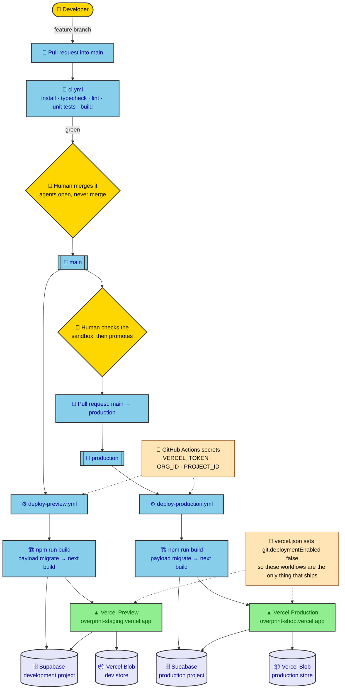
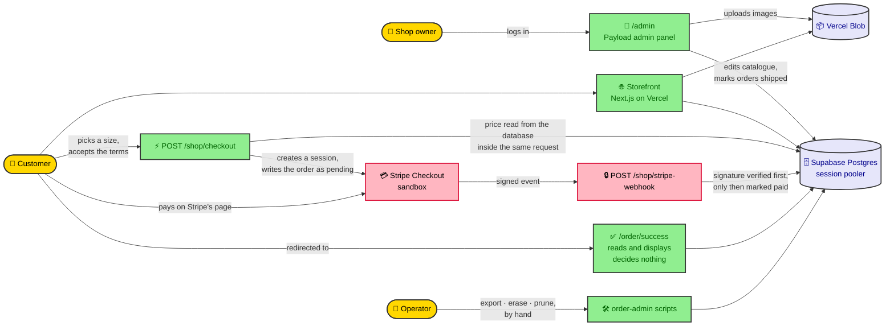

# Overprint

Overprint is a small print-on-demand t-shirt shop. The owner logs into an admin
panel and manages a catalogue of a few shirt designs — name, price, description,
product image. A visitor browses the catalogue, picks a shirt, and pays through
Stripe's hosted Checkout running in sandbox; the order is marked paid only when
Stripe's own signed webhook confirms it.

The catalogue is the CMS. The shirt sale is the payment. Remove the CMS and the
owner can't change the catalogue without a redeploy; remove Stripe and nothing is
sold.

- **Production:** https://overprint-shop.vercel.app
- **Sandbox preview:** https://overprint-staging.vercel.app (Stripe test mode; safe to poke at)

## Stack

- **Next.js 16** (App Router) — frontend and the two payment route handlers
- **Payload CMS 3**, self-hosted inside the Next.js app — catalogue and orders
- **Supabase Postgres** — Payload's database, via the session pooler
- **Vercel Blob** — product image storage, through Payload's storage adapter
- **Stripe Checkout** (sandbox) — hosted payment page, confirmed by webhook
- **Vitest** (unit + integration) and **Playwright** (e2e) for tests
- **GitHub Actions** for CI and for deploys — see [the pipeline](#deployment-pipeline) below

## Architecture

Four services, each doing one job. GitHub decides *when* something ships, Vercel runs it,
Supabase holds the data, Stripe takes the money, and Vercel Blob stores the images.

### How a change reaches the live site



The two deploy paths are the same workflow shape pointed at different environments, and
each build runs `payload migrate` against whichever `DATABASE_URI` `vercel pull` fetched
for it — so a migration always runs against the database it belongs to, and no database
credential ever has to live in a GitHub secret.

### Who talks to what at runtime



The two arrows worth following are the ones into Postgres. The price that reaches Stripe is
read from the database inside the same request that creates the session, so the browser
never supplies it. And the only arrow that writes `status: paid` comes from the webhook,
after its signature has been checked — not from the customer returning to the success page.

## How the owner edits the shop

Everything a non-technical owner needs is in the Payload admin panel at
[`/admin`](https://overprint-shop.vercel.app/admin). No deploy, no pull request, no code.

**Sign in** with the admin account for that environment. Production and the sandbox have
separate accounts and separate databases, so editing one never touches the other.

**Products** — the catalogue. Each shirt carries a name, a URL slug, a price, a
description, an image and a sold-out checkbox:

| Field | Notes for the owner |
|---|---|
| Name | Shown on the catalogue and the product page |
| Slug | The URL segment, e.g. `midnight-tee` → `/products/midnight-tee` |
| Price | **In cents.** `2500` means EUR 25.00. Whole numbers only |
| Description | A short paragraph on the product page |
| Image | Uploaded straight from the browser to Vercel Blob |
| Sold out | Ticking it hides the buy button *and* refuses checkout server-side |

**Changes are live immediately.** The catalogue and product pages are rendered per request
(`export const dynamic = 'force-dynamic'`), so they read the database on every visit. Edit a
price, save, reload the shop — the new price is there, with no build and no deploy. That is
the whole point of putting the catalogue in a CMS.

**Media** — uploaded images. Each carries alt text and a **Generated By** setting
(*AI-generated* / *Photograph* / *Unknown*). Images marked AI-generated show a visible
"AI-generated image" caption on the public site; see [The legal page](#the-legal-page).

**Orders** — read-only, with one exception. The owner can set **Fulfilment status** to
*Shipped*, and nothing else: the money and payment fields are locked at field level, so an
order can only become *paid* through Stripe's verified webhook. See
[Fulfilment](#fulfilment).

## Local setup

1. **Node 22 via Volta.** The repo pins `22.23.2` in `package.json`'s `volta` key
   and `22` in `.nvmrc`. Install [Volta](https://volta.sh), then just run `npm`/`npx`
   normally inside the repo — Volta shims to the pinned version automatically.

2. **Two Supabase projects.** This project deliberately uses a development
   Supabase project and a separate production one — never one database for both.
   Create (or get access to) the dev project, and take its **session-mode pooler**
   connection string (port `5432`, host contains `pooler.supabase.com`). Transaction
   mode (port `6543`) drops the prepared statements Payload's Drizzle adapter needs.

3. **Copy `.env.example` to `.env`** and fill it in:
   - `DATABASE_URI` — the dev project's session-pooler string, as above.
   - `SEED_DEV_PROJECT_REF` — the dev project's ref (the `postgres.XXXX` part of
     the username in `DATABASE_URI`). Four scripts check this before they will
     touch anything, so each can positively confirm it's aimed at development:
     `scripts/seed.ts` and the three [order-data scripts](#order-data-export-erasure-and-retention),
     which read, redact and delete customer orders.
   - `PAYLOAD_SECRET` — any long random string (`openssl rand -hex 32`).
   - `BLOB_READ_WRITE_TOKEN` — a Vercel Blob read/write token for the dev store.
   - `STRIPE_SECRET_KEY` / `STRIPE_PUBLISHABLE_KEY` — Stripe **test-mode** keys
     (`sk_test_…` / `pk_test_…`) from your own or a shared Stripe sandbox account.
   - `STRIPE_WEBHOOK_SECRET` — see the `stripe listen` step below.
   - `NEXT_PUBLIC_SERVER_URL` — `http://localhost:3000` for local dev.

4. **Install and run migrations**, then seed some demo products:

   ```
   npm install
   npx payload migrate
   npm run seed
   ```

   `npm run seed` is idempotent and refuses to run against anything it can't
   positively confirm is the dev database (see [Known limitations](#known-limitations)
   for the one gap in that guard).

5. **Forward Stripe webhooks to your machine.** In a separate terminal:

   ```
   stripe listen --forward-to localhost:3000/shop/stripe-webhook
   ```

   Copy the `whsec_…` value it prints into `STRIPE_WEBHOOK_SECRET` in `.env`.

6. **Run the app:**

   ```
   npm run dev
   ```

   Visit `http://localhost:3000` for the storefront and `/admin` for the CMS.

### Pages

| Path | What it is |
|---|---|
| `/` | Start page — the banner, and more to come |
| `/products` | The t-shirt catalogue |
| `/products/<slug>` | One shirt: size, terms consent, buy |
| `/legal` | Legal and privacy |
| `/order/success` | Order confirmation, which decides nothing |

A header (wordmark, and links to the catalogue and the legal page) and a footer sit
on every storefront page and on none of `/admin` — both live in the `(frontend)`
layout, which the `(payload)` route group never imports.

### Schema changes

Payload's schema `push` mode is off everywhere (`push: false` in
`src/payload.config.ts`), including local development — adding, renaming, or
removing a collection field requires a real migration. See the **"Schema
changes: migrate, never push"** section of [`CLAUDE.md`](./CLAUDE.md) for why,
and for the exact commands.

**Running `payload migrate` locally changes what the sandbox deployment reads.**
Preview and local development share one development Supabase project (see
[Environment separation](#environment-separation)), so a migration run on your
machine applies to the database `overprint-staging.vercel.app` is already
serving. Adding a column is harmless — the deployed code simply never selects
it. Renaming or dropping one takes the storefront down with a
`column ... does not exist` error until the code that matches the new schema is
deployed; `/admin` keeps answering, because it does not run the catalogue query.
That window is expected, and it closes when the pull request lands. Don't
hand-edit the database to close it early. If you need a working sandbox in the
meantime, deploy the branch to its own preview URL with `vercel deploy` and
leave the staging alias where it is.

## The two-card test

Manual, human-visible proof that the payment logic actually gates on Stripe's
webhook rather than on the browser reaching a success page. At Stripe Checkout,
use any future expiry date and any three-digit CVC with:

| Card number | Outcome |
|---|---|
| `4242 4242 4242 4242` | Payment succeeds. Stripe's webhook fires, and the order flips to **paid** in the admin panel. |
| `4000 0000 0000 0002` | Card is **declined** at Stripe. No successful webhook event is produced, and the order stays **pending** — nothing is ever marked paid for a declined card. |

## How payment actually works

1. The browser sends a product id, the chosen size, and terms acceptance to
   `POST /shop/checkout`.
2. The server loads that product from Payload **by id, inside the same request**,
   and reads its price from the database. The client never supplies a price, a
   name, or an amount — a client-supplied price would be a free-shirt button.
3. If the product is sold out, checkout is refused; no Stripe session and no
   order are created.
4. A Stripe Checkout Session is created from that price (inline `price_data`,
   not a pre-created Stripe Product — see the [go-live plan](docs/go-live-plan.md)
   for why that matters later). An `orders` row is written with `status: 'pending'`.
5. The browser is redirected to Stripe to pay.
6. Stripe calls `POST /shop/stripe-webhook` with a signed event. The signature is
   verified against `STRIPE_WEBHOOK_SECRET`; an invalid or missing signature gets
   a `400` and nothing is written. Only on a verified `checkout.session.completed`
   with `payment_status: 'paid'` does the order flip to **paid**.
7. The success page (`/order/success`) reads that order back from our own
   database and displays it. It has no authority to mark anything paid — if the
   webhook hasn't landed yet, it shows a "confirming payment" state rather than
   claiming success.

Both handlers live outside `/api` (`/shop/checkout`, `/shop/stripe-webhook`)
because Payload mounts its own REST API at `/api/[...slug]`.

## Sizes, shipping, and consent

- **Size.** `SIZES` (`src/lib/constants.ts`) is `['S', 'M', 'L', 'XL']`, a
  catalogue-wide constant — every shirt comes in all four sizes, so this is
  deliberately not a per-product field, the same way `CURRENCY` isn't.
  Default `M`. The server checks the submitted size against this list with an
  exact string match (no trimming, no case-folding) and rejects anything else
  with a `400`. The size actually bought is snapshotted onto the order line
  as `sizeSnapshot`.
- **Shipping address.** Collected by Stripe itself
  (`shipping_address_collection`, Germany only) and read back from
  `session.collected_information.shipping_details` in the webhook handler.
  This is a trap: Stripe moved shipping details there from a top-level field
  in its Basil API version, and this project is pinned to a later version —
  the old top-level path silently resolves to `undefined` rather than
  erroring, so following older documentation here would compile, run, and
  collect nothing.
- **Terms consent.** Collected on **our own site**, not by Stripe: a required
  checkbox on the product page linking to [`/legal`](#the-legal-page), sent
  with the checkout request and re-checked server-side with a strict
  `=== true` identity test (a truthy value like the string `"true"` doesn't
  count). Accepted consent is timestamped as `orders.termsAcceptedAt`. This
  runs on our own page rather than through Stripe's `consent_collection`
  because that feature requires a Terms-of-Service URL set in the Stripe
  dashboard, which cannot be set without activating the account — forbidden
  by `CLAUDE.md`.

## Fulfilment

An admin marks an order shipped from its edit page in `/admin`. `Orders`'
collection-level `update` is open to any logged-in admin, but only
`fulfilmentStatus` is actually writable — the other eleven fields
(`stripeCheckoutSessionId`, `stripePaymentIntentId`, `email`, `shippingName`,
`shippingAddress`, `status`, `amountTotal`, `paidAt`, `termsAcceptedAt`,
`fulfilledAt`, `items`) each carry field-level `access: { update: () =>
false }`, so a browser can change the fulfilment status and nothing else.
`fulfilledAt` is set by a `beforeChange` hook when `fulfilmentStatus` flips to
`shipped`, and cleared if it flips back — never set by hand.

## The legal page

`/legal` covers what the shop is, who runs it, the AI-image disclosure, and a
privacy notice (what's collected, retention, and how to exercise access or
erasure rights). It's linked from a footer on every storefront page
(`SiteFooter.tsx`) and nowhere in `/admin` — the two audiences don't share
chrome.

### Required after this deploys: label the production images

`/legal` says that any AI-generated image is labelled as such on its product
page. That label is drawn from each image's **Generated By** field, which
defaults to **Unknown** — and every image already in production was uploaded
before the field existed, so all four currently read **Unknown** and no label
appears. Until the owner does the following, the legal page's claim is not true
on the live site. Nothing scripts this on purpose: stating how an image was made
is the owner's assertion, not something code should assume.

1. Go to **https://overprint-shop.vercel.app/admin/collections/media** and log in.
2. You should see a list of four images. Click the first one.
3. Scroll to the field labelled **Generated By**. It will say **Unknown**.
4. Click it and choose **AI-generated**.
5. Click the **Save** button (top right of the page).
6. Click **Media** in the left-hand menu to get back to the list, and repeat
   steps 2–5 for each of the other three images.
7. Check it worked: open **https://overprint-shop.vercel.app**, click into any
   product, and confirm the words *AI-generated image* now appear underneath
   the picture.

## Order data: export, erasure, and retention

Three scripts under `scripts/`. Run `export:order` through its npm script and
not a bare `tsx` invocation — it's the one with a stdout contract to protect
(see `PAYLOAD_LOG_TO_STDERR` below); the other two only log for a human to read:

| Script | Does |
|---|---|
| `npm run export:order -- --email <e>` or `-- --session <id>` | Writes every matching order to stdout as JSON. |
| `npm run erase:order -- --email <e> [--confirm]` (or `--session <id>`) | Redacts every matching order's identity fields. |
| `npm run prune:orders [-- --confirm]` | Applies retention: deletes stale unpaid orders, redacts stale paid ones. |

`--email` / `--session` pick the target order(s) for `export:order` and
`erase:order`. `erase:order` and `prune:orders` write nothing without an
explicit `--confirm` — without it, each prints its plan (which orders, what
it would do) and exits. All three refuse to run with `NODE_ENV=production`,
or when `DATABASE_URI` can't be confirmed as the development project — a
project-ref guard shaped like `scripts/seed.ts`'s, but checking `NODE_ENV`
first, unconditionally, so no override can rescue a production target. The
project-ref half is the half that does the work, and
[`ORDER_ADMIN_ALLOW_UNSAFE=1`](#known-limitations) switches it off.

**Retention:** unpaid/expired orders are deleted after 30 days; paid orders
are kept 2 years, then redacted (identity fields cleared, amount and date
kept as a commercial record). Both are measured from `createdAt`. This is
enforced manually — `prune:orders` only prunes when an operator runs it;
nothing happens on a schedule.

**`PAYLOAD_LOG_TO_STDERR`**, set only by these three npm scripts
(`src/payload.config.ts`), redirects Payload's own logger to stderr so it
can't interleave with — and corrupt — the JSON `export:order` writes to
stdout. Running `export:order` directly with `tsx` skips this and produces
JSON with a log line in the middle of it.

## Deployment pipeline

```
feat/*  --PR-->  main  --(deploys sandbox preview)
                  |
                  '--merge-->  production  --(deploys live site)
```

- A feature or fix branch is opened as a pull request into `main`. CI
  (`.github/workflows/ci.yml`) runs install, typecheck, lint, unit tests, and
  build on every PR.
- Merging into `main` triggers `.github/workflows/deploy-preview.yml`, which
  builds and deploys against the **Preview** environment and points the stable
  staging alias at it. This is what serves `overprint-staging.vercel.app`.
- Once the sandbox preview has been checked, `main` is merged into `production`
  (by the human — see `CLAUDE.md`'s production rules). That push triggers
  `.github/workflows/deploy-production.yml`, which builds and deploys against
  the **Production** environment. This is what serves `overprint-shop.vercel.app`.
- **Vercel's own git-triggered deploys are off.** `vercel.json` sets
  `"git": { "deploymentEnabled": false }`, so nothing ships except through these
  two GitHub Actions workflows — visible in the repository rather than a
  dashboard toggle someone could flip back.
- Both workflows run `payload migrate` as part of the build (`npm run build` is
  `payload migrate && next build`), against whichever `DATABASE_URI` `vercel pull`
  fetches for that environment — so migrations always run against the right
  database and no database credential needs to live in a GitHub secret.

## Environment separation

Preview and Production point at **different** Supabase projects, different Blob
stores, and different Stripe webhook endpoints (though the same Stripe sandbox
account, since this project never leaves test mode). No secret value is
reproduced below — only what each variable is for and how it differs by
environment.

| Variable | Preview | Production |
|---|---|---|
| `DATABASE_URI` | Dev Supabase project, session pooler | **Separate** prod Supabase project, session pooler |
| `SEED_DEV_PROJECT_REF` | Dev project's ref, so `seed`, `export:order`, `erase:order` and `prune:orders` can each confirm they're pointed at dev | Not set — all four are local/dev-only tools, never run against Production |
| `ORDER_ADMIN_ALLOW_UNSAFE` | Not set. Setting it to `1` switches off that project-ref check for the three order scripts — a human override, see [Known limitations](#known-limitations) | Not set, and must never be |
| `PAYLOAD_SECRET` | Its own value | A different value from Preview |
| `BLOB_READ_WRITE_TOKEN` | Token for the dev Blob store | Token for a **separate** prod Blob store |
| `STRIPE_SECRET_KEY` | `sk_test_…` (sandbox) | `sk_test_…` (sandbox) — see the [go-live plan](docs/go-live-plan.md) for the switch to live |
| `STRIPE_PUBLISHABLE_KEY` | `pk_test_…`, set but unused — see [Known limitations](#known-limitations) | same |
| `STRIPE_WEBHOOK_SECRET` | Signing secret for the **preview** webhook endpoint | Signing secret for a **separate, production** webhook endpoint |
| `NEXT_PUBLIC_SERVER_URL` | The stable staging alias | The production URL |
| `VERCEL_TOKEN` / `VERCEL_ORG_ID` / `VERCEL_PROJECT_ID` | GitHub Actions secrets, not environment variables — used only by the deploy workflows | same |

Each environment's variables are configured in Vercel's Preview and Production
scopes; the GitHub Actions ones live only in the repository's encrypted Actions
secrets. Local development uses its own `.env`, pointed at the dev Supabase
project and a local `stripe listen` webhook secret — never a shared file.

## Optional tasks completed

The brief asks for at least one, through a dedicated feature branch and pull request. Six
were done, each on its own branch with its own PR.

| Task | Tier | Where to see it |
|---|---|---|
| **Order confirmation page** | Easy | [`/order/success`](https://overprint-shop.vercel.app/order/success) — lists what was bought and confirms the order is paid. It reads the order back and displays it; it has no authority to mark anything paid |
| **Sold-out state from the admin panel** | Easy | Tick *Sold out* on a product. The buy button disappears **and** `POST /shop/checkout` refuses it with a 409, so it is enforced server-side rather than only hidden |
| **An Orders collection in Payload** | Medium | `src/collections/Orders.ts`. A row is written as `pending` when checkout starts and only the verified webhook flips it to `paid` |
| **Instant-rollback rehearsal** | Medium | [`docs/rollback-rehearsal.md`](docs/rollback-rehearsal.md) — the shop name was broken on purpose, promoted to production, recovered with Vercel's instant rollback, then properly reverted. Two findings came out of it that are worth more than the exercise: **CI passed on the broken change**, and **the rollback fixed the deployment while leaving the repository broken** |
| **A written go-live plan** | Hard | [`docs/go-live-plan.md`](docs/go-live-plan.md) — what switching to real payments would require. A plan, not a log: nothing in it has been executed and the shop stays in the sandbox |
| **A documented migration flow** | Hard | [Schema changes](#schema-changes) here and the *"migrate, never push"* section of [`CLAUDE.md`](./CLAUDE.md). Every schema change is a committed migration, applied to development first and carried to production by the same pull-request pipeline as the code |

Not attempted: a custom domain, a scheduled health check, and a second owner-editable
collection such as an About or FAQ page.

## What this is not

The shop demonstrates the two halves the brief asks for — an owner-editable catalogue and a
payment confirmed by a verified webhook. It is not a business. Print-on-demand is its
premise, not an integration: **no fulfilment provider is contacted, nothing is printed, and
nothing ships.**

[`docs/what-a-real-shop-would-need.md`](docs/what-a-real-shop-would-need.md) is the gap
list — what sits between this and a shop that could take an order and post a shirt. It
covers the missing provider integration, why a display image is not a print file, how the
money actually flows between Stripe, you and the printer, the customer emails that do not
exist, and the legal position that changes the moment anything is sold for real. It also
names the one thing that would block a real shop on day one: the catalogue is built on band
names.

## Known limitations

Recorded here rather than left for a reviewer to find on their own:

- **No Stripe publishable key is actually used.** Redirecting the browser to
  `session.url` (the pattern this app uses) only needs the Stripe **secret**
  key. `STRIPE_PUBLISHABLE_KEY` is set in every environment for completeness
  and because the brief names it, but nothing in the code reads it.
- **Product images use a plain `` tag**, not `next/image` — there is no
  image optimisation (resizing, format negotiation, lazy-loading beyond the
  browser default). Moving to `next/image` would also need
  `images.remotePatterns` configured for the Vercel Blob host.
- **`price` has no database `CHECK` constraint.** Integer-cents is enforced in
  the admin UI, in Payload's Local API, and at the REST and GraphQL layers (see
  `validatePrice` in `src/collections/Products.ts`), but a direct SQL write
  against Postgres could still insert a fractional value.
- **`SEED_ALLOW_UNSAFE=1` is checked before the `NODE_ENV` check** in
  `scripts/seed.ts`. That means a stray `SEED_ALLOW_UNSAFE=1` left in a shell
  or an `.env` file would bypass the production guard as well as the
  project-ref guard — the override is meant for a human to reach for
  deliberately, not to be a value that can be left lying around safely.
- **`ORDER_ADMIN_ALLOW_UNSAFE=1` leaves the order scripts with one real guard.**
  It switches off the project-ref check in `src/lib/order-admin.ts` for
  `export:order`, `erase:order` and `prune:orders` — the scripts that export,
  redact and delete customer orders. Unlike `SEED_ALLOW_UNSAFE` it is read
  *after* the `NODE_ENV === 'production'` check, so no value of it can rescue a
  production target. But that surviving check is close to inert in practice:
  `tsx` sets no `NODE_ENV`, and neither do these three npm scripts, so in a real
  invocation `NODE_ENV` is `undefined` and the project-ref comparison is the
  only guard actually doing work. Switching it off leaves nothing. Like the seed
  override, it is for a human to reach for deliberately, never a value to leave
  set in a shell or an `.env` file.
- **`npm test` can exhaust Supabase's 15-connection session-pool limit** when
  its `tests/int` integration files run against a live database in parallel.
  It passes reliably with `npm test -- --no-file-parallelism`. CI is
  unaffected: it runs only `npm run test:unit`, which needs no database
  connection at all.
- **Schema changes require a migration**, in every environment including local
  development — see [Schema changes](#schema-changes) above and the relevant
  section of [`CLAUDE.md`](./CLAUDE.md).

## Further reading

- [`docs/evidence/`](docs/evidence/) — screenshots and verifiable output backing the
  claims above: the successful and declined card runs on both environments, Stripe's
  webhook delivery log showing a 200, the rollback before and after, the pull-request
  history, and the live endpoint checks. It also lists, honestly, what was *not*
  captured.
- [`docs/what-a-real-shop-would-need.md`](docs/what-a-real-shop-would-need.md) — the gap
  between this demonstration and an operating print-on-demand business: fulfilment, print
  files, how the money moves, customer email, and what changes legally once anything is
  really sold.
- [`docs/go-live-plan.md`](docs/go-live-plan.md) — what switching this shop from
  Stripe sandbox to real, live payments would require. Nothing in it has been
  executed; it's a plan, not a log.
- [`docs/rollback-rehearsal.md`](docs/rollback-rehearsal.md) — a deliberate production
  break, recovered with Vercel's instant rollback, then properly reverted. Unlike the
  go-live plan, this one *was* executed against the live site. Three findings, including
  the two that matter most: CI passed on the broken change, and the rollback fixed the
  deployment while leaving the repository broken.
- [`docs/superpowers/specs/2026-09-04-shop-design.md`](docs/superpowers/specs/2026-09-04-shop-design.md) — the design document this shop was built from.
- [`docs/superpowers/plans/2026-09-04-shop.md`](docs/superpowers/plans/2026-09-04-shop.md) — the task-by-task implementation plan.
- [`CLAUDE.md`](./CLAUDE.md) — constraints and production rules for anyone (human or agent) working in this repository.
